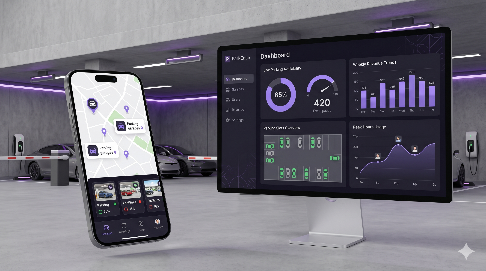
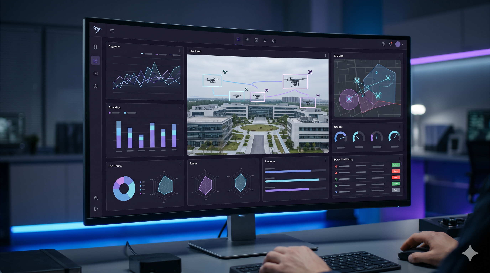
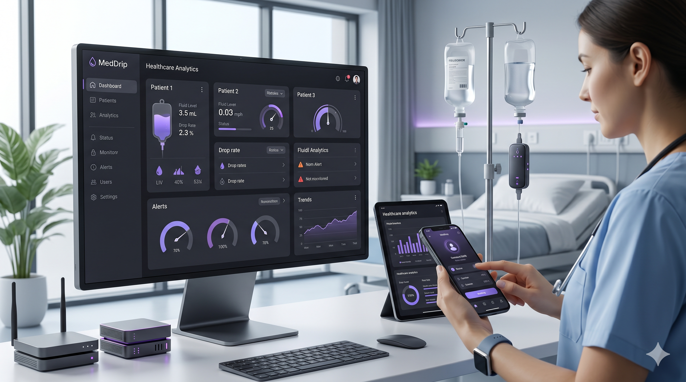

# Hello 👋, I'm Prakhar Das

### Flutter Developer | Full-Stack Developer | Software Engineer | IoT & AI Enthusiast

 

🧠 Problem Solver &nbsp;&nbsp;&nbsp; ⚡ Tech Enthusiast &nbsp;&nbsp;&nbsp; 📚 Lifelong Learner &nbsp;&nbsp;&nbsp; 🚀 Builder

  
  
  
  
  
  
  
  
  

 

---

# 👨‍💻 About Me

<table>
<tr>

<td width="50%">

### 🚀 Full-Stack & Flutter Developer

Computer Engineering student passionate about building scalable and real-world software solutions.

### 💡 What I Work With

- Flutter & Firebase
- React & Node.js
- Flask & Python
- AI & Computer Vision
- ESP32 & IoT Systems

### ⚡ Interests

- Real-Time Systems
- AI Applications
- Mobile Development
- Full-Stack Engineering
- Computer Vision

</td>

<td width="50%">

</td>

</tr>
</table>

---

# ⚡ Tech Stack

<table>

<tr>

<td align="center" width="160">

### Languages

 

</td>

<td align="center" width="160">

### Frontend

 

</td>

<td align="center" width="160">

### Mobile

</td>

<td align="center" width="160">

### Backend

 

</td>

<td align="center" width="160">

### Databases

</td>

<td align="center" width="160">

### AI / ML

  

YOLOv7  
OpenCV

</td>

</tr>

</table>

 

### Tools & Platforms

 

---

# 🚀 Featured Projects

<table>

<tr>

<td width="33%">

## 🅿️ ParkEase

### Smart IoT Parking System

`Flutter` `Firebase` `ESP32`

Real-time smart parking system with slot booking and live monitoring.

 

</td>

<td width="33%">

## 🛸 Hawkeye

### AI Drone Detection System

`React` `Flask` `YOLOv7`

Real-time drone detection platform using AI and computer vision.

 

</td>

<td width="33%">

## 💉 MedDrip

### IoT Saline Monitoring

`Flutter` `Firebase` `ESP32`

Healthcare IoT platform for real-time saline monitoring and alerts.

 

</td>

</tr>

</table>

---

# 📊 GitHub Analytics

  

---

# 📄 Resume

---

# 📫 Contact

&nbsp;

&nbsp;

---

# ⭐ Code. Build. Learn. Repeat.

### Striving to build software that makes a difference 🚀

